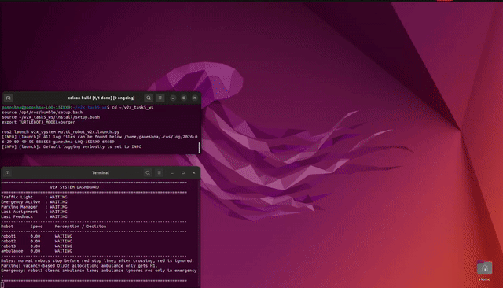
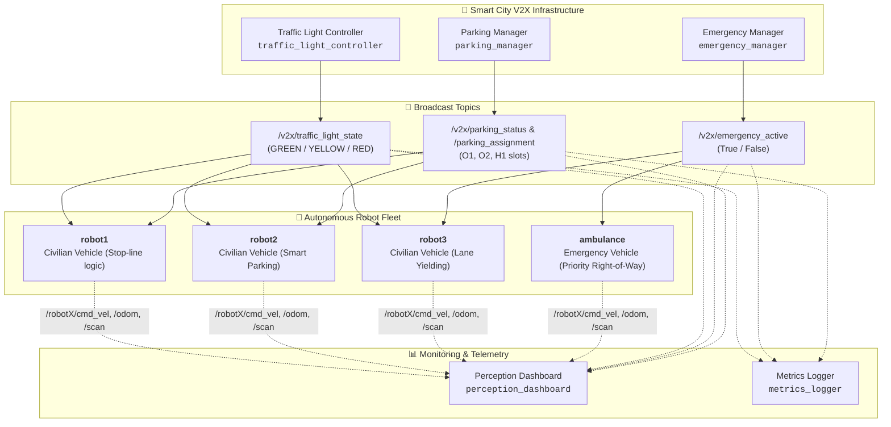

# V2X Multi-Robot Autonomous Transportation System

[](https://docs.ros.org/en/humble/)
[](http://gazebosim.org/)
[](https://www.python.org/)
[](https://ubuntu.com/)
[](https://emanual.robotis.com/docs/en/platform/turtlebot3/overview/)
[](LICENSE)

A robust **Vehicle-to-Everything (V2X)** multi-robot simulation environment implemented in **ROS 2 Humble** and **Gazebo 11**. The system features **Vehicle-to-Infrastructure (V2I)** and **Vehicle-to-Vehicle (V2V)** communication protocols, coordinated traffic light intersections, dynamic emergency vehicle corridor clearance, intelligent vacancy-based parking allocation, and a real-time terminal perception dashboard.

---

## 🎬 Live Simulation Demo



> *Full HD simulation video available at: [`docs/videos/v2x_simulation_demo.mp4`](docs/videos/v2x_simulation_demo.mp4)*

---

## 📌 Table of Contents
- [System Architecture](#-system-architecture)
- [Key Features & Capabilities](#-key-features--capabilities)
- [Robot Fleet Specifications](#-robot-fleet-specifications)
- [ROS 2 Topic & Interface Specification](#-ros-2-topic--interface-specification)
- [Perception Dashboard](#-perception-dashboard)
- [Installation & Prerequisites](#-installation--prerequisites)
- [Building & Running the Simulation](#-building--running-the-simulation)
- [Engineering Challenges & Solutions](#-engineering-challenges--solutions)
- [Repository Structure](#-repository-structure)
- [License](#-license)

---

## 🏗 System Architecture

The simulation deploys a modular, decentralized multi-agent architecture where civilian vehicles and emergency response units communicate with smart city infrastructure nodes over ROS 2 topics:



---

## 🚦 Key Features & Capabilities

### 1. Smart Traffic Signal Coordination (V2I)
* **Node:** `traffic_light_controller`
* **Topic:** `/v2x/traffic_light_state`
* Broadcasts periodic traffic cycles (`GREEN` ➔ `YELLOW` ➔ `RED`).
* **Anti-Deadlock Crossing Logic:** Civilian vehicles inspect their real-time distance to the intersection stop line. Once a vehicle crosses the stop line on `GREEN`, it persistently ignores subsequent `RED` phases, eliminating intersection deadlocks.

### 2. Dynamic Emergency Priority & Corridor Clearance (V2V / V2I)
* **Node:** `emergency_manager`
* **Topic:** `/v2x/emergency_active`
* Tracks the `ambulance` position towards the emergency hospital zone.
* When the emergency corridor is active:
  * The **`ambulance`** receives priority override, bypassing red traffic lights safely.
  * **`robot3`** detects the approaching ambulance, calculates an evasive offset, and temporarily yields to keep the primary travel lane clear.

### 3. Smart Vacancy-Based Parking Allocation (V2I)
* **Node:** `parking_manager`
* **Topics:** `/v2x/parking_status`, `/v2x/parking_assignment`, `/v2x/parking_feedback`
* Manages parking slots (`O1`, `O2`, `H1`).
* As autonomous vehicles enter the parking sector, slots are dynamically allocated based on real-time occupancy. If parking bays are fully occupied, vehicles smoothly continue forward without erratic reversing or blocking road lanes.

### 4. Real-Time Perception Dashboard
* **Node:** `perception_dashboard`
* Provides a synchronized CLI monitoring panel displaying traffic light states, emergency vehicle proximity, slot vacancies, and live speed/perception states for every robot in the fleet.

---

## 🤖 Robot Fleet Specifications

| Robot Identifier | Role / Profile | Script / Node | Primary Subscriptions | Behaviors |
| :--- | :--- | :--- | :--- | :--- |
| **`robot1`** | Civilian Vehicle | `robot_agent` | `/v2x/traffic_light_state`, `/robot1/scan`, `/robot1/odom` | Stop-line compliance, intersection navigation |
| **`robot2`** | Civilian Vehicle | `robot_agent` | `/v2x/parking_assignment`, `/robot2/scan`, `/robot2/odom` | Traffic compliance, smart parking bay maneuvering |
| **`robot3`** | Civilian Vehicle | `robot_agent` | `/v2x/emergency_active`, `/robot3/scan`, `/robot3/odom` | Traffic compliance, emergency lane yielding |
| **`ambulance`** | Emergency Vehicle | `robot_agent` | `/v2x/emergency_active`, `/ambulance/odom` | Red light override, high-priority emergency transit |

---

## 📡 ROS 2 Topic & Interface Specification

| Topic | Message Type | Publisher | Description |
| :--- | :--- | :--- | :--- |
| `/v2x/traffic_light_state` | `std_msgs/msg/String` | `traffic_light_controller` | Broadcasts current state (`GREEN`, `YELLOW`, `RED`) |
| `/v2x/emergency_active` | `std_msgs/msg/Bool` | `emergency_manager` | Triggers corridor clearance (`True`/`False`) |
| `/v2x/parking_status` | `std_msgs/msg/String` | `parking_manager` | Real-time status of bays (`O1`, `O2`, `H1`) |
| `/v2x/parking_assignment` | `std_msgs/msg/String` | `parking_manager` | Assigned parking slot coordinates for vehicles |
| `/robotX/cmd_vel` | `geometry_msgs/msg/Twist` | `robot_agent` | Linear and angular velocity drive commands |
| `/robotX/odom` | `nav_msgs/msg/Odometry` | Gazebo Diff-Drive | Ground truth position and heading feedback |
| `/robotX/scan` | `sensor_msgs/msg/LaserScan` | Gazebo LiDAR Plugin | Obstacle detection & collision avoidance |

---

## 📊 Perception Dashboard

Launch the live telemetry dashboard to observe real-time decision making:

```
======================================================================
                     V2X REAL-TIME PERCEPTION DASHBOARD               
======================================================================
 Traffic Light   : [ GREEN ]          Emergency Status : [ INACTIVE ]
 Parking Status  : [ O1: FREE | O2: FREE | H1: OCCUPIED ]             
----------------------------------------------------------------------
 ROBOT       SPEED (m/s)   PERCEPTION / DECISION STATE
----------------------------------------------------------------------
 robot1      0.15 m/s      CRUISING | Traffic Light: GREEN
 robot2      0.12 m/s      PARKING_APPROACH -> Slot: O1
 robot3      0.00 m/s      YIELDING_FOR_AMBULANCE | Lane Cleared
 ambulance   0.22 m/s      EMERGENCY_ACTIVE | Red Light Bypass
======================================================================
```

---

## ⚙️ Installation & Prerequisites

### Prerequisites
* **Ubuntu 22.04 LTS**
* **ROS 2 Humble Hawksbill** (Desktop Install)
* **Gazebo 11** (`gazebo_ros_pkgs`)
* **TurtleBot3 Packages:**
  ```bash
  sudo apt update
  sudo apt install -y ros-humble-turtlebot3 ros-humble-turtlebot3-msgs \
                      ros-humble-turtlebot3-gazebo ros-humble-gazebo-ros-pkgs
  ```

---

## 🚀 Building & Running the Simulation

### 1. Build the Workspace
```bash
cd ~/v2x_task5_ws
source /opt/ros/humble/setup.bash
colcon build --packages-select v2x_system
source install/setup.bash
```

### 2. Set Model Environment & Launch Simulation
```bash
export TURTLEBOT3_MODEL=burger
ros2 launch v2x_system multi_robot_v2x.launch.py
```

### 3. Launch Perception Dashboard (In a New Terminal)
```bash
cd ~/v2x_task5_ws
source /opt/ros/humble/setup.bash
source install/setup.bash
ros2 run v2x_system perception_dashboard
```

### 4. Multi-Terminal Developer Suite
To launch Gazebo and all topic echo terminals simultaneously in separate tabs:
```bash
chmod +x demo_terminals.sh
./demo_terminals.sh
```

---

## 💡 Engineering Challenges & Solutions

1. **Multi-Robot Namespace Collision:**  
   * *Problem:* Multiple TurtleBot3 instances conflicted on standard `/cmd_vel` and `/odom` topics.
   * *Solution:* Built dynamic namespace isolation (`/robot1`, `/robot2`, `/robot3`, `/ambulance`) in the launch architecture.

2. **Intersection Stop-Line Deadlocks:**  
   * *Problem:* Robots crossing on green would stop mid-intersection when the cycle transitioned to red.
   * *Solution:* Implemented spatial threshold latches that lock the crossing state once the front bumper crosses coordinate $x_{stop}$.

3. **Smooth Emergency Lane Clearing:**  
   * *Problem:* Evasive maneuvers pushed vehicles onto sidewalk collision boundaries.
   * *Solution:* Designed target waypoint offsets that reposition yielding vehicles into trailing queue slots inside valid road bounds.

---

## 📂 Repository Structure

```
.
├── .gitignore                      # Clean ROS 2 gitignore configuration
├── README.md                       # Repository documentation
├── demo_terminals.sh               # Multi-tab terminal launcher script
├── docs/
│   ├── assets/                     # Architectural diagrams & screenshots
│   │   ├── v2x_simulation_demo.gif # Animated simulation preview
│   │   └── dashboard_screenshot.png# Dashboard screenshot
│   └── videos/
│       └── v2x_simulation_demo.mp4 # Full demonstration video
└── src/
    └── v2x_system/
        ├── launch/
        │   └── multi_robot_v2x.launch.py
        ├── v2x_system/
        │   ├── __init__.py
        │   ├── traffic_light_controller.py
        │   ├── emergency_manager.py
        │   ├── parking_manager.py
        │   ├── robot_agent.py
        │   ├── perception_dashboard.py
        │   └── metrics_logger.py
        ├── worlds/
        │   └── v2x_city.world
        ├── package.xml
        └── setup.py
```

---

## 📄 License
This project is licensed under the [MIT License](LICENSE).
